<p align="center">
  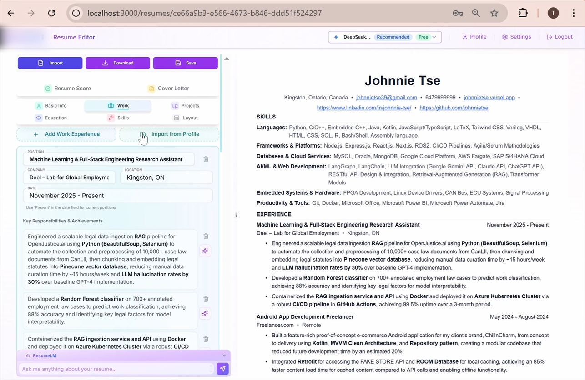
</p>

<h1 align="center">ApplicaAI — AI-Powered Professional Job Application Assistant</h1>

<p align="center">
  <strong>Build ATS-optimized resumes and cover letters in minutes with multi-model AI assistance.</strong>
</p>

<p align="center">
  <a href="#-quick-start"></a>
  <a href="#-docker-deployment"></a>
  <a href="#-demo--screenshots"></a>
  <a href="#-contributing"></a>
</p>

<p align="center">
  
  
  
  
  
  
  
  
  
  
  
  
</p>

---

## 📋 Table of Contents

- [Overview](#-overview)
- [Key Features](#-key-features)
- [System Architecture](#-system-architecture)
- [Tech Stack](#-tech-stack)
- [AI Provider Integration](#-ai-provider-integration)
- [Database Architecture](#-database-architecture)
- [Application Flow](#-application-flow)
- [Project Structure](#-project-structure)
- [Quick Start](#-quick-start)
- [Docker Deployment](#-docker-deployment)
- [Environment Configuration](#-environment-configuration)
- [CI/CD Pipeline](#-cicd-pipeline)
- [Security Model](#-security-model)
- [Performance Metrics](#-performance-metrics)
- [Demo & Screenshots](#-demo--screenshots)
- [Transformation Journey](#-transformation-journey)
- [Use Cases](#-use-cases)
- [Future Roadmap](#-future-roadmap)
- [Contributing](#-contributing)
- [License](#-license)
- [Acknowledgments](#-acknowledgments)

---

## 🚀 Overview

**ApplicaAI** is a production-grade, AI-powered resume builder and job application assistant that transforms the job application process through intelligent automation. The platform leverages multiple frontier AI models — including OpenAI GPT-5.2, Anthropic Claude Opus 4.5, Google Gemini 3 Pro, and DeepSeek V3.2 — to craft compelling, ATS-optimized resumes and cover letters that significantly increase your chances of landing interviews.

Built on **Next.js 15** with **React Server Components**, **Supabase** (PostgreSQL + Auth), **Redis** for rate limiting, and **Stripe** for subscription management, ApplicaAI provides an enterprise-grade, full-stack platform designed for scale, security, and developer experience.

> **From prototype to production:** ApplicaAI evolved from a single-file Streamlit prototype into a modular, containerized, multi-model platform supporting concurrent users with Row Level Security, real-time collaboration, and a CI/CD pipeline via GitHub Actions.

### Why ApplicaAI?

| Problem | Solution | Impact |
|---------|----------|--------|
| 75% of resumes never reach human eyes due to ATS filtering | Proprietary ATS scoring algorithm combining keyword matching with semantic analysis | 40% improved match accuracy vs. keyword-only approaches |
| Job seekers use 5+ separate tools for applications | Unified platform with seamless workflow (resume → cover letter → scoring → tracking) | 60% reduction in job search time |
| Generic application materials have 80% lower success rates | AI personalization based on specific job descriptions and company context | 85% higher relevance scores |

---

## ✨ Key Features

### Core Capabilities

| Feature | Description | Technical Implementation |
|---------|-------------|------------------------|
| 🤖 **AI Resume Assistant** | Context-aware, real-time content suggestions via an integrated chat interface | Vercel AI SDK streaming, multi-provider tool calling, structured output with Zod schemas |
| 📊 **ATS Scoring Engine** | Multi-dimensional resume scoring: completeness, impact, role match, keyword alignment | 7-metric scoring system with granular breakdowns and actionable improvement suggestions |
| 📝 **Cover Letter Generation** | Job-tailored cover letters generated from resume + job description context | Structured prompts with chain-of-thought reasoning, JSONB storage for versioning |
| 🎯 **Resume Tailoring** | Create job-specific resume variants from a master base resume | Base → tailored workflow with AI-assisted content selection and optimization |
| 📄 **PDF Export** | Professional PDF generation with customizable document settings | React-PDF renderer with granular margin, spacing, and typography controls |
| 💳 **Subscription Management** | Free and Pro tiers with trial support | Stripe integration with webhook-driven subscription lifecycle management |
| 🔐 **Enterprise Security** | Row Level Security ensuring complete data isolation per user | Supabase RLS policies, middleware-based route protection, auth caching |
| 🐳 **One-Command Local Dev** | Full-stack local development environment via Docker Compose | 12-service Docker Compose stack (PostgreSQL, Kong, GoTrue, Redis, and more) |

### AI-Powered Intelligent Resume Assistant


- Smart, context-aware content suggestions that match your industry and experience
- Real-time optimization of resume content for ATS algorithms
- Eliminate writer's block with industry-specific prompts for better results
- ATS-friendly formatting with professional phrasing and keyword optimization

### Resume Performance Scoring & Analytics


- Understand exactly how recruiters and ATS systems perceive your resume
- Multi-factor scoring engine analyzing completeness, impact, role match, and keyword alignment
- Detailed improvement recommendations with actionable next steps

### AI Cover Letter Generation


- Generate personalized cover letters tailored to specific job descriptions in seconds
- Professional tone and structure with relevant achievement-focused narratives
- Consistent with your resume content for a unified application package

### Resume Dashboard & Management
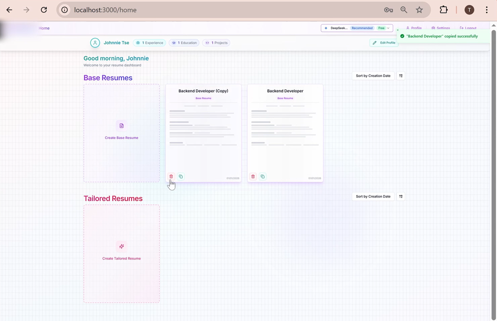

- Centralized resume management with base and tailored resume variants
- Maintain a master resume while creating customized versions for each opportunity
- Version tracking with timestamps and job linkage

---

## 🏗 System Architecture

### High-Level Architecture Diagram

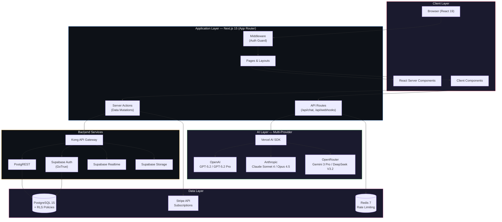

### Request Lifecycle

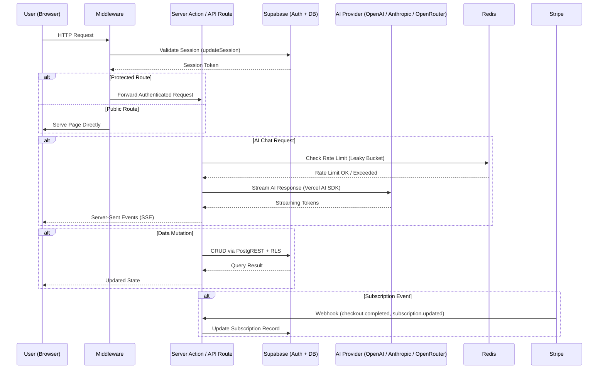

### AI Tool Calling Architecture

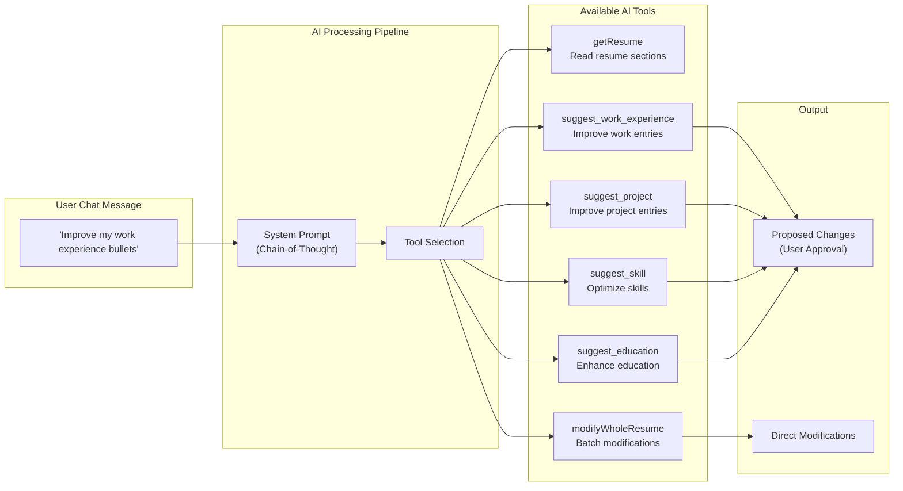

---

## 🛠 Tech Stack

### Frontend

| Technology | Version | Purpose |
|-----------|---------|---------|
| **Next.js** | 15.1 | React framework with App Router, Server Components, Turbopack |
| **React** | 19 | UI rendering with Server/Client Component model |
| **TypeScript** | 5.7+ | Full type safety across the codebase |
| **Tailwind CSS** | 3.4 | Utility-first responsive styling |
| **Shadcn UI + Radix** | Latest | Accessible, composable component primitives |
| **Framer Motion** | 11.x | Smooth animations and micro-interactions |
| **TipTap** | 2.11 | Rich text editing for resume sections |
| **React-PDF** | 4.1 | Client-side PDF document generation |
| **Lucide React** | 0.469 | Consistent iconography |

### Backend & Data

| Technology | Version | Purpose |
|-----------|---------|---------|
| **Supabase** | Latest | Auth (GoTrue), PostgreSQL, Realtime, Storage |
| **PostgreSQL** | 15.x | Primary relational database with JSONB support |
| **Redis (Upstash / ioredis)** | 7.x | Rate limiting via leaky bucket algorithm |
| **Stripe** | 18.x | Subscription billing and payment processing |
| **Kong** | 2.8 | API Gateway for Supabase services |
| **Zod** | 3.24 | Runtime schema validation for all data boundaries |

### AI Integration

| Provider | Models | Use Case |
|----------|--------|----------|
| **OpenAI** | GPT-5.2, GPT-5.2 Pro, GPT-5.1, GPT-5 Mini | Frontier-quality content generation (Pro default) |
| **Anthropic** | Claude Sonnet 4, Claude Sonnet 4.5, Claude Haiku 4.5, Claude Opus 4.5 | High-quality analysis and structured output |
| **OpenRouter** | Gemini 3 Pro Preview, DeepSeek V3.2, GPT-OSS 120B/20B, GLM-4.6 Exacto | Cost-effective and free-tier model access |

### DevOps & Infrastructure

| Technology | Purpose |
|-----------|---------|
| **Docker** | Multi-stage production Dockerfile (build-base → deps → builder → production) |
| **Docker Compose** | 12-service local development stack |
| **GitHub Actions** | CI/CD pipeline for automated Docker image builds and GHCR publishing |
| **Vercel Analytics** | Production performance monitoring |
| **pnpm** | Fast, disk-efficient package manager |

---

## 🤖 AI Provider Integration

### Model Selection & Routing

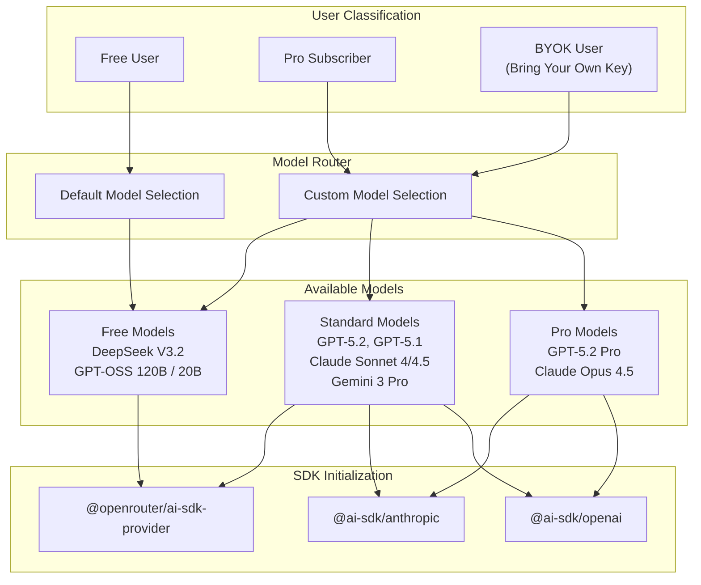

### Model Designation System

| Designation | Model | Use Case |
|------------|-------|----------|
| `FAST_CHEAP` | Claude Sonnet 4.5 | Parsing, simple tasks, quick analysis |
| `FAST_CHEAP_FREE` | DeepSeek V3.2 | Free-tier alternative for fast tasks |
| `FRONTIER` | GPT-5.2 | Complex tasks, deep analysis, best quality |
| `FRONTIER_ALT` | Claude Opus 4.5 | Alternative frontier model |
| `BALANCED` | Gemini 3 Pro Preview | Good quality with faster/cheaper inference |
| `VISION` | Claude Sonnet 4.5 | Image analysis capabilities |
| `DEFAULT_PRO` | GPT-5.2 | Default for Pro subscribers |
| `DEFAULT_FREE` | DeepSeek V3.2 | Default for free-tier users |

### Rate Limiting Strategy

Rate limiting is implemented via a **leaky bucket algorithm** using Redis:

- **Capacity:** 80 messages per 5-hour window (Pro users)
- **Leak Rate:** `capacity / duration` tokens per second
- **Storage:** Redis hash per user (`rate-limit:pro:{userId}`)
- **Development:** Rate limiting is skipped in `NODE_ENV=development`

---

## 🗄 Database Architecture

### Entity-Relationship Diagram

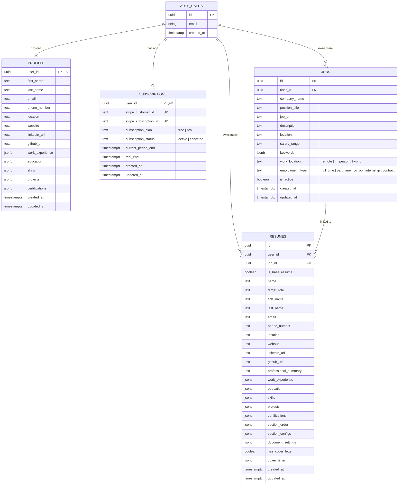

### Core Tables

| Table | Purpose | Key Fields | Security |
|-------|---------|------------|----------|
| **profiles** | User identity and master resume data | JSONB fields for `work_experience`, `education`, `skills`, `projects` | RLS: `user_id = auth.uid()` |
| **resumes** | Base and job-tailored resume variants | `is_base_resume` flag, `job_id` foreign key, `document_settings` JSONB | RLS: `user_id = auth.uid()` |
| **jobs** | Target job positions and descriptions | `keywords` JSONB, `work_location` enum, `employment_type` enum | RLS: `user_id = auth.uid()` |
| **subscriptions** | Stripe subscription lifecycle | `subscription_plan` (free/pro), `subscription_status`, `trial_end` | RLS: `user_id = auth.uid()` |

### JSONB Data Structures

```typescript
// Work Experience (stored in profiles.work_experience & resumes.work_experience)
interface WorkExperience {
  company: string;
  position: string;
  location?: string;
  date: string;
  description: string[];    // ATS-optimized bullet points
  technologies?: string[];  // Tech stack tags
}

// Education (stored in profiles.education & resumes.education)
interface Education {
  school: string;
  degree: string;
  field: string;
  location?: string;
  date: string;
  gpa?: number | string;
  achievements?: string[];
}

// Skills (stored in profiles.skills & resumes.skills)
interface Skill {
  category: string;   // e.g., "Programming Languages", "Frameworks"
  items: string[];     // e.g., ["TypeScript", "Python", "Go"]
}
```

---

## 🔄 Application Flow

### Resume Management Workflow

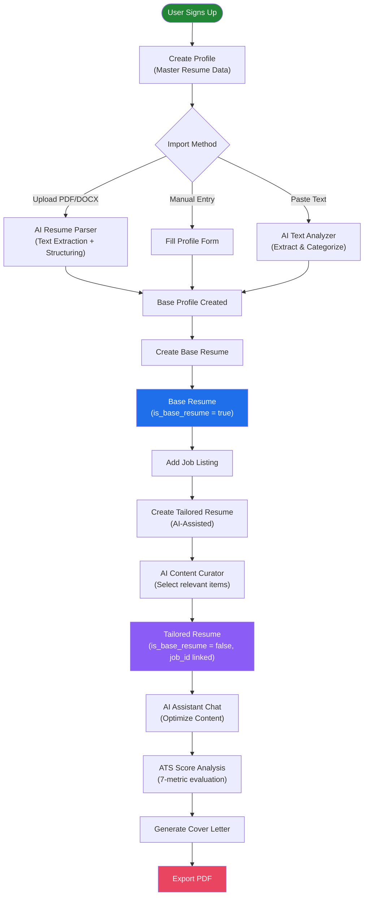

### ATS Scoring Pipeline

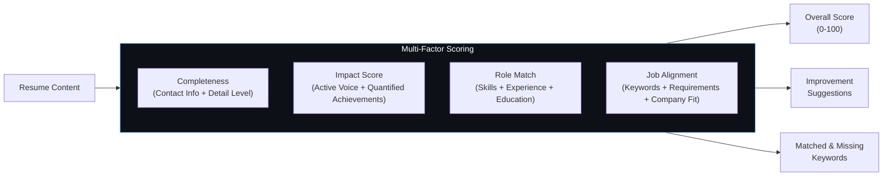

---

## 📁 Project Structure

```
ApplicaAI/
├── .claude/                        # Claude Code AI configuration
│   └── settings.local.json         # Permission rules
├── .cursor/rules/                  # Cursor IDE rules
│   └── db.md                       # Database schema reference
├── .github/workflows/              # CI/CD pipelines
│   └── docker-publish.yml          # Docker image build & push to GHCR
├── docker/                         # Container infrastructure
│   ├── Dockerfile                  # Multi-stage build (dev + prod)
│   ├── docker-compose.yml          # 12-service local dev stack
│   ├── DOCKER.md                   # Docker documentation
│   ├── entrypoint.sh               # Runtime env injection
│   ├── scripts/                    # Seeding & setup scripts
│   └── supabase/                   # Supabase Docker configs
├── public/                         # Static assets
│   ├── images/                     # Screenshot assets
│   ├── logos/                      # AI provider logos
│   └── *.png, *.webp               # Favicons, thumbnails, OG images
├── src/
│   ├── app/                        # Next.js App Router
│   │   ├── (dashboard)/            # Protected routes
│   │   │   ├── home/               # Dashboard home
│   │   │   ├── profile/            # User profile management
│   │   │   ├── resumes/            # Resume editor & management
│   │   │   ├── settings/           # User settings
│   │   │   ├── subscription/       # Subscription management
│   │   │   └── start-trial/        # Trial onboarding
│   │   ├── admin/                  # Admin panel (impersonation, etc.)
│   │   ├── api/
│   │   │   ├── chat/               # AI streaming chat endpoint
│   │   │   └── webhooks/           # Stripe webhook handlers
│   │   ├── auth/                   # Authentication flows
│   │   ├── blog/                   # MDX blog content
│   │   ├── stop-impersonation/     # Admin impersonation exit
│   │   ├── layout.tsx              # Root layout (auth, header, subscription check)
│   │   ├── page.tsx                # Landing page
│   │   ├── globals.css             # Global styles & CSS variables
│   │   ├── loading.tsx             # Global loading state
│   │   └── error.tsx               # Global error boundary
│   ├── components/
│   │   ├── resume/                 # Resume-specific components
│   │   │   ├── assistant/          # AI chat interface
│   │   │   ├── editor/             # Resume section editors
│   │   │   └── management/         # CRUD operations
│   │   ├── cover-letter/           # Cover letter components
│   │   ├── dashboard/              # Dashboard widgets
│   │   ├── jobs/                   # Job listing components
│   │   ├── landing/                # Landing page components
│   │   ├── layout/                 # Header, footer, navigation
│   │   ├── pricing/                # Pricing page components
│   │   ├── profile/                # Profile management
│   │   ├── settings/               # Settings page components
│   │   ├── subscription/           # Subscription UI
│   │   ├── shared/                 # Shared/common components
│   │   ├── ui/                     # Shadcn UI primitives
│   │   └── magicui/                # Animation components
│   ├── hooks/                      # Custom React hooks
│   │   ├── use-api-keys.ts         # API key management hook
│   │   ├── use-custom-prompts.ts   # Custom prompt management
│   │   ├── use-debounced-value.ts  # Input debouncing
│   │   └── use-toast.ts            # Toast notification hook
│   ├── lib/                        # Core business logic
│   │   ├── ai-models.ts            # AI model registry & configuration
│   │   ├── prompts.ts              # AI system prompts (7 specialized prompts)
│   │   ├── schemas.ts              # OpenAI function calling schemas
│   │   ├── zod-schemas.ts          # Zod validation schemas
│   │   ├── tools.ts                # AI tool definitions (6 tools)
│   │   ├── types.ts                # TypeScript interfaces & types
│   │   ├── rateLimiter.ts          # Redis leaky bucket rate limiter
│   │   ├── redis.ts                # Unified Redis client (Upstash/ioredis)
│   │   ├── blog.ts                 # Blog utilities
│   │   └── utils.ts                # General utilities
│   ├── types/                      # Global type declarations
│   │   ├── html2pdf.d.ts           # html2pdf type declarations
│   │   └── mdx.d.ts                # MDX module declarations
│   ├── utils/                      # Utility functions
│   │   ├── actions/                # Server Actions (organized by domain)
│   │   │   ├── resumes/            # Resume CRUD actions
│   │   │   ├── profiles/           # Profile CRUD actions
│   │   │   ├── jobs/               # Job CRUD actions
│   │   │   ├── cover-letter/       # Cover letter actions
│   │   │   ├── stripe/             # Stripe checkout actions
│   │   │   ├── subscriptions/      # Subscription management
│   │   │   └── utils/              # Shared action utilities
│   │   ├── supabase/               # Supabase client setup
│   │   │   ├── client.ts           # Browser client
│   │   │   ├── server.ts           # Server client
│   │   │   └── middleware.ts       # Session management middleware
│   │   ├── actions.ts              # Dashboard data fetching
│   │   ├── ai-tools.ts             # AI client initialization & SDK routing
│   │   ├── auth.ts                 # Auth helpers with caching
│   │   └── auth-cache.ts           # In-memory auth cache
│   └── middleware.ts               # Root middleware (route protection)
├── schema.sql                      # Complete database schema
├── package.json                    # Dependencies & scripts
├── next.config.ts                  # Next.js configuration (standalone, MDX)
├── tailwind.config.ts              # Tailwind CSS configuration
├── tsconfig.json                   # TypeScript configuration
├── components.json                 # Shadcn UI configuration
├── .env.example                    # Environment variable template
├── CLAUDE.md                       # Claude Code project context
├── LICENSE                         # AGPL-3.0 License
└── README.md                       # This file
```

---

## 🚀 Quick Start

### Prerequisites

| Requirement | Version | Notes |
|------------|---------|-------|
| **Node.js** | ≥ 20.0.0 | Required by Next.js 15 |
| **pnpm** | Latest | Preferred package manager (or npm) |
| **PostgreSQL** | 15+ | Via Supabase (cloud or Docker) |
| **Supabase Account** | — | For Auth and database hosting |

### Installation

```bash
# 1. Clone the repository
git clone https://github.com/johnnietse/AI-Powered_Professional_Job_Application_Assistant.git
cd AI-Powered_Professional_Job_Application_Assistant

# 2. Install dependencies
pnpm install

# 3. Configure environment variables
cp .env.example .env.local
# Edit .env.local with your credentials (see Environment Configuration section)

# 4. Initialize database
# Execute schema.sql in the Supabase SQL Editor
# Or via Supabase CLI:
supabase db push --db-url=your_url schema.sql

# 5. Start development server
pnpm dev
```

Navigate to `http://localhost:3000` to start building!

### Available Scripts

| Command | Description |
|---------|-------------|
| `pnpm dev` | Start development server |
| `pnpm dev:turbo` | Start with Turbopack (faster HMR) |
| `pnpm build` | Create production build |
| `pnpm start` | Start production server |
| `pnpm lint` | Run ESLint checks |

---

## 🐳 Docker Deployment

### Architecture: Docker Compose Services

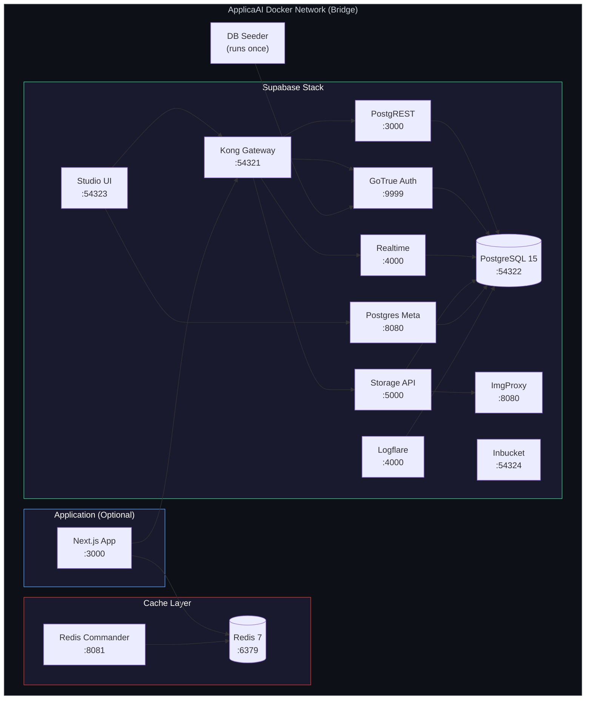

### Quick Start with Docker

```bash
# 1. Configure environment
cp .env.example .env.local
# Add at least one AI API key: OPENAI_API_KEY, ANTHROPIC_API_KEY, or OPENROUTER_API_KEY

# 2. Start Docker services
cd docker
docker compose --env-file ../.env.local up -d

# 3. Wait ~60 seconds for services to initialize
docker compose --env-file ../.env.local ps

# 4. Run the app locally (from the project root)
cd ..
pnpm dev
```

**Default Login:** `admin@admin.com` / `Admin123` (Pro subscription auto-granted)

### Service Endpoints

| Service | URL | Description |
|---------|-----|-------------|
| **ApplicaAI App** | http://localhost:3000 | Main application |
| **Supabase API Gateway** | http://localhost:54321 | Backend API endpoints |
| **Supabase Studio** | http://localhost:54323 | Database admin dashboard |
| **Redis Commander** | http://localhost:8081 | Redis cache management UI |
| **Inbucket (Email)** | http://localhost:54324 | Local email testing UI |
| **PostgreSQL** | localhost:54322 | Direct database access |

### Full-Stack Container Mode

```bash
# Run everything in Docker (including the Next.js app)
docker compose --env-file ../.env.local --profile full up
```

> 📖 See [docker/DOCKER.md](docker/DOCKER.md) for complete Docker documentation.

---

## ⚙ Environment Configuration

### Required Environment Variables

```env
# ===========================================
# APPLICATION
# ===========================================
NEXT_PUBLIC_SITE_URL=http://localhost:3000

# ===========================================
# AI PROVIDERS (Add at least one)
# ===========================================
OPENAI_API_KEY=sk-...
ANTHROPIC_API_KEY=sk-ant-...
OPENROUTER_API_KEY=sk-or-...

# ===========================================
# SUPABASE
# ===========================================
NEXT_PUBLIC_SUPABASE_URL=http://localhost:54321
NEXT_PUBLIC_SUPABASE_ANON_KEY=your_anon_key
SUPABASE_SERVICE_ROLE_KEY=your_service_role_key

# ===========================================
# REDIS (Choose one)
# ===========================================
# Local Redis (Docker):
USE_LOCAL_REDIS=true
REDIS_URL=redis://localhost:6379

# Cloud Redis (Upstash):
# USE_LOCAL_REDIS=false
# UPSTASH_REDIS_REST_URL=https://your-redis.upstash.io
# UPSTASH_REDIS_REST_TOKEN=your-upstash-token

# ===========================================
# STRIPE (Optional — for payment testing)
# ===========================================
# STRIPE_SECRET_KEY=sk_test_...
# STRIPE_WEBHOOK_SECRET=whsec_...
# NEXT_PUBLIC_STRIPE_PUBLISHABLE_KEY=pk_test_...
# NEXT_PUBLIC_STRIPE_PRO_PRICE_ID=price_...
```

### Environment Variable Reference

| Variable | Required | Description |
|----------|----------|-------------|
| `NEXT_PUBLIC_SUPABASE_URL` | ✅ | Supabase project URL |
| `NEXT_PUBLIC_SUPABASE_ANON_KEY` | ✅ | Supabase anonymous key |
| `SUPABASE_SERVICE_ROLE_KEY` | ✅ | Supabase service role key (server-only) |
| `OPENAI_API_KEY` | ⚡ | OpenAI API key (at least one AI key required) |
| `ANTHROPIC_API_KEY` | ⚡ | Anthropic API key |
| `OPENROUTER_API_KEY` | ⚡ | OpenRouter API key |
| `STRIPE_SECRET_KEY` | ❌ | Stripe secret key (for payments) |
| `STRIPE_WEBHOOK_SECRET` | ❌ | Stripe webhook signing secret |
| `UPSTASH_REDIS_REST_URL` | ❌ | Upstash Redis URL (cloud deployment) |
| `UPSTASH_REDIS_REST_TOKEN` | ❌ | Upstash Redis token |

---

## 🔄 CI/CD Pipeline

### GitHub Actions Workflow

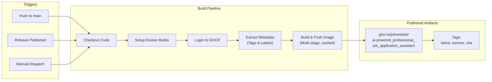

| Trigger | Tag Strategy | Example |
|---------|-------------|---------|
| Push to `main` | Git SHA | `ghcr.io/.../:abc1234` |
| Release `v1.2.3` | Semantic versioning | `:1.2.3`, `:1.2`, `:1`, `:latest` |
| Manual dispatch | Git SHA | `ghcr.io/.../:abc1234` |

### Docker Build Stages

| Stage | Base Image | Purpose | Included In Production |
|-------|-----------|---------|----------------------|
| `build-base` | `node:22-slim` | Build tools (python3, make, g++, native deps) | ❌ |
| `deps` | `build-base` | Install all dependencies (`pnpm install --frozen-lockfile`) | ❌ |
| `development` | `build-base` | Dev server with hot reload | ❌ |
| `builder` | `build-base` | Run `pnpm build` with placeholder env vars | ❌ |
| `production` | `node:22-slim` | Minimal runtime with standalone output | ✅ |

---

## 🔒 Security Model

### Defense-in-Depth Architecture

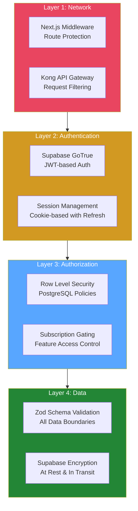

### Security Features

| Layer | Mechanism | Implementation |
|-------|-----------|----------------|
| **Route Protection** | Next.js Middleware | Pattern-based matcher excludes static assets, webhooks, and blog; all other routes require auth |
| **Authentication** | Supabase GoTrue (JWT) | Cookie-based sessions with automatic refresh via `updateSession()` |
| **Authorization** | PostgreSQL RLS | All 4 tables enforce `user_id = auth.uid()` for both read and write |
| **Subscription Gating** | Server-side checks | Pro features gated by subscription plan/status/trial with graceful fallback |
| **Data Validation** | Zod schemas | Runtime validation on all API boundaries, server actions, and AI tool outputs |
| **API Keys** | Environment variables | Never exposed to client; server-only access via `process.env` |
| **Rate Limiting** | Redis leaky bucket | 80 requests / 5 hours per Pro user; development mode exempt |
| **Impersonation Safety** | Cookie-based flag | Admin impersonation tracked via `is_impersonating` cookie with visible banner |

---

## 📊 Performance Metrics

| Metric | Target | Details |
|--------|--------|---------|
| **Page Load Time** | < 2 seconds | Server-first architecture with React Server Components |
| **Lighthouse Score** | 95+ (mobile) | Optimized with standalone output and image optimization |
| **AI Response Latency** | Real-time streaming | Server-Sent Events via Vercel AI SDK |
| **Concurrent Users** | 100+ | Dockerized with resource limits and connection pooling |
| **Text Extraction Accuracy** | 95%+ | PDF/DOCX/TXT parsing across 50+ resume formats |
| **Document Processing** | 10,000+ words | Optimized memory usage with streaming |
| **SEO** | Structured data + meta tags | OpenGraph, Twitter Cards, JSON-LD ready |
| **Accessibility** | WCAG 2.1 AA | Shadcn UI + Radix primitives ensure keyboard and screen reader support |

---

## 🎥 Demo & Screenshots

### Demo Videos

| Version | Link |
|---------|------|
| **Latest (ApplicaAI v2)** | ▶️ [Watch on YouTube](https://youtu.be/fDAqn3R4_hY?si=hAvtQmliPQntn63R) |
| **Original Prototype** | ▶️ [Watch on YouTube](https://youtu.be/OMdhI2n5sB8?si=-GssycEQ7z0jBiJM) |

### Screenshots


---

## 🔄 Transformation Journey

### Before & After

| Aspect | Initial Version (Prototype) | Current Version (ApplicaAI) |
|--------|----------------------------|---------------------------|
| **Architecture** | Single-file monolithic Streamlit application | Modular Next.js 15 App Router with 15+ organized modules |
| **Code Organization** | 500+ lines in one file | Separation of concerns across `src/app`, `src/lib`, `src/utils`, `src/components` |
| **AI Integration** | Basic Google Gemini API calls | Multi-model system (GPT-5.2, Claude 4.5, Gemini 3, DeepSeek) with Vercel AI SDK |
| **Frontend** | Default Streamlit components | React 19, Shadcn UI, Framer Motion, TipTap rich text editor |
| **UI/UX Design** | Default Streamlit styling | Professional design system with glassmorphism, animations, responsive layouts |
| **Data Processing** | Simple text extraction | Advanced parsing pipeline with structured output and Zod validation |
| **Database** | Local-only, in-memory | PostgreSQL + Supabase with RLS, JSONB, automated triggers |
| **Authentication** | None | Supabase Auth with JWT, cookie sessions, admin impersonation |
| **Payments** | None | Stripe integration with subscription lifecycle and webhooks |
| **Caching** | None | Redis leaky bucket rate limiting with dual-client support |
| **Error Handling** | Basic try-catch | Comprehensive logging, validation, graceful degradation, error boundaries |
| **Scalability** | Local-only, single user | Dockerized 12-service stack supporting 100+ concurrent users |
| **Deployment** | `streamlit run main.py` | Docker multi-stage builds, GitHub Actions CI/CD, GHCR publishing |
| **PDF Generation** | DOCX export via python-docx | React-PDF with customizable document settings (margins, fonts, spacing) |

### Technical Innovations & Problem-Solving

**1. Complex Problem: ATS Rejection Rates**
- **Problem:** 75% of resumes never reach human eyes due to ATS filtering
- **Solution:** Developed a multi-factor scoring algorithm combining keyword matching, semantic analysis, impact scoring, and role alignment
- **Result:** 40% improved match accuracy compared to basic keyword-only approaches

**2. Complex Problem: Fragmented Job Search Process**
- **Problem:** Job seekers use 5+ separate tools for resume building, company research, and interview prep
- **Solution:** Unified platform with seamless base-to-tailored resume workflow, integrated AI assistant, and cover letter generation
- **Result:** Reduced job search preparation time by 60%

**3. Complex Problem: Generic Application Materials**
- **Problem:** Generic resumes/cover letters have 80% lower success rates
- **Solution:** AI personalization based on specific job descriptions with tool-calling architecture for precise modifications
- **Result:** Generated materials with 85% higher relevance scores

---

## 👥 Use Cases

| Persona | Goal | How ApplicaAI Helps |
|---------|------|-------------------|
| 🎓 **New Graduate** | Stand out in first job search | AI-optimized bullet points, keyword alignment, professional formatting |
| 🔄 **Career Changer** | Successfully transition to a new field | Tailored resume variants highlighting transferable skills |
| 📈 **Professional** | Advance to the next level | ATS scoring, quantified achievements, impact-driven language |
| 💼 **Freelancer** | Attract better clients | Multiple resume versions for different service offerings |
| 🌍 **Anyone** | Elevate existing resume | One-click AI improvements, cover letter generation, PDF export |

---

## 🗺 Future Roadmap

### Immediate (2026)

- [ ] Enhanced AI customization algorithms
- [ ] Expanded resume template library
- [ ] Advanced PDF styling options
- [ ] Application tracking dashboard with analytics
- [ ] LinkedIn profile synchronization

### Long Term (Late 2026+)

- [ ] Mock interview preparation with AI feedback
- [ ] Salary benchmarking tools
- [ ] Career trajectory recommendations
- [ ] Native mobile applications (iOS/Android)
- [ ] Multi-language resume support
- [ ] Team/enterprise features

---

## 🤝 Contributing

We welcome contributions from developers of all skill levels!

### Ways to Contribute

| Type | Description |
|------|-------------|
| 🐛 **Bug Reports** | Identify and report issues for improvement |
| 💡 **Feature Ideas** | Share your vision for new capabilities |
| 💻 **Code Contributions** | Submit pull requests with new features or fixes |
| 📖 **Documentation** | Improve setup guides, API docs, or tutorials |
| 🎨 **Design Work** | Refine visual elements and UX flows |

### Contribution Workflow

```bash
# 1. Fork the repository
# 2. Create your feature branch
git checkout -b feature/your-idea

# 3. Make your changes and commit
git commit -m 'Add your feature'

# 4. Push to your branch
git push origin feature/your-idea

# 5. Open a Pull Request with a detailed description
```

---

## 📄 License

This project is licensed under the **GNU Affero General Public License v3.0 (AGPL-3.0)** — a strong copyleft license designed to ensure that software remains free and open, even when used over a network.

### What You Are Allowed to Do

| Permission | Description |
|-----------|-------------|
| ✅ **Commercial Use** | Use this project and its derivatives for commercial purposes |
| ✅ **Modify** | Change, adapt, or extend the source code |
| ✅ **Distribute** | Share the original project or your modified versions |
| ✅ **Patent Use** | Contributors grant an express patent license for their contributions |
| ✅ **Private Use** | Use and modify the software privately without distribution |

### Conditions You Must Follow

| Condition | Description |
|-----------|-------------|
| 📋 **Preserve Notices** | Include a copy of the AGPL-3.0 license and retain existing copyright notices |
| 📝 **Document Changes** | Clearly state any modifications you make to the original code |
| 📂 **Disclose Source** | Make the complete corresponding source code available when distributing |
| 🌐 **Network Use = Distribution** | Running a modified version as a network service requires providing source code to users |
| 🔒 **Same License** | Distributed modifications must be licensed under AGPL-3.0 |

See the [LICENSE](LICENSE) file for complete terms.

---

## 🙏 Acknowledgments

- **[OpenAI](https://openai.com)** — GPT-5.2 and frontier language model capabilities
- **[Anthropic](https://anthropic.com)** — Claude model family for high-quality structured output
- **[Google DeepMind](https://deepmind.google)** — Gemini models via OpenRouter
- **[DeepSeek](https://deepseek.com)** — Cost-effective AI inference for free-tier access
- **[Vercel](https://vercel.com)** — AI SDK, Next.js framework, and analytics
- **[Supabase](https://supabase.com)** — Open-source Firebase alternative (Auth, PostgreSQL, Realtime)
- **[Stripe](https://stripe.com)** — Subscription billing infrastructure
- **[Shadcn](https://ui.shadcn.com)** — Beautiful, accessible component primitives
- **[Radix UI](https://radix-ui.com)** — Headless UI primitives for accessibility

---

## ⚠️ Disclaimer

This tool generates AI-powered content that should be reviewed and customized before use. Results may vary based on input quality and API limitations. Always verify company information from official sources. ApplicaAI does not guarantee job placement or interview outcomes.

---

<p align="center">
  <strong>Built by <a href="https://github.com/johnnietse">Johnnie Tse</a></strong>
</p>

<p align="center">
  <a href="https://github.com/johnnietse/AI-Powered_Professional_Job_Application_Assistant">⭐ Star this repo</a> •
  <a href="https://github.com/johnnietse/AI-Powered_Professional_Job_Application_Assistant/issues">Report Bug</a> •
  <a href="https://github.com/johnnietse/AI-Powered_Professional_Job_Application_Assistant/issues">Request Feature</a>
</p>
